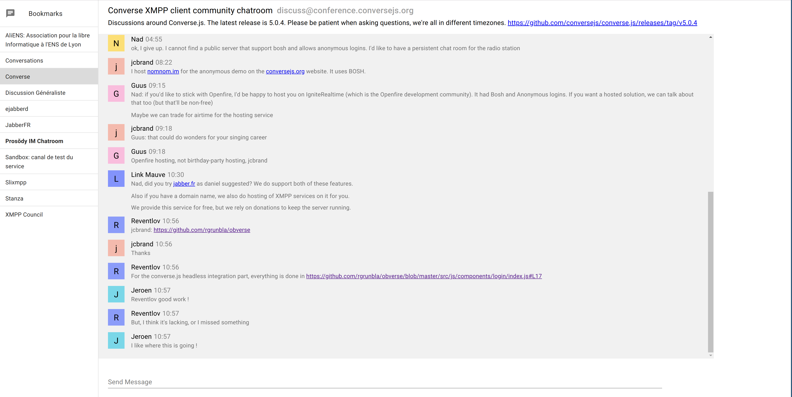

# Obverse

This is a project of an alternative UI based for the converse.js XMPP client,
based on react.

Right now, it's close to unusable, the code is a mess, it's feature-less, but
it's a start.

## UI

